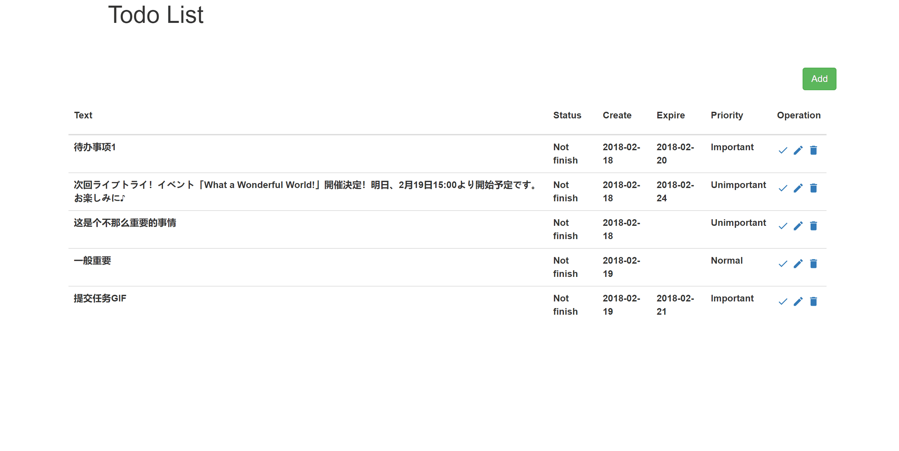
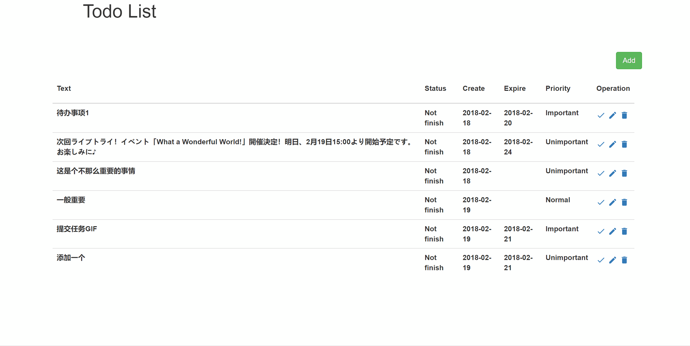
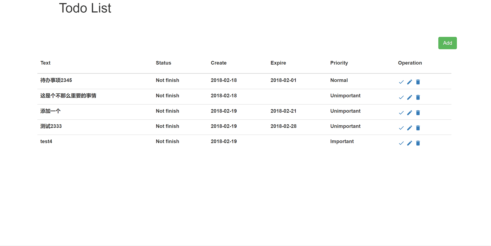
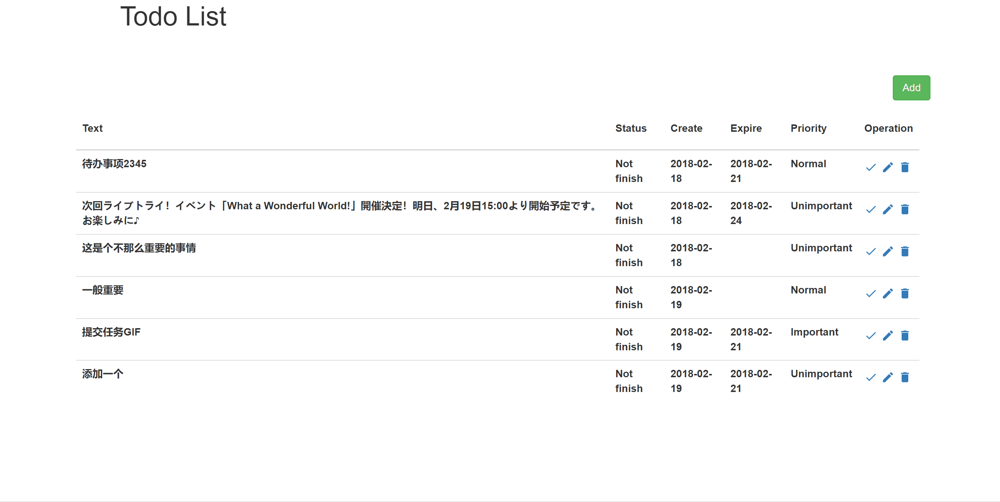

# TodoList

jiuzhang interview

## 已经实现的功能

* 增加一个待办事项
* 删除一个待办事项
* 标记一个待办事项为已完成
* 编辑一个待办事项的具体内容
* 列出所有的待办事项
* 待办事项可以设置优先级
* 待办事项可以设置expire date
* 支持按照不同的方式排序，如优先级，expire date

## 未实现的功能

* 列表界面支持翻页

## GIF

### 增加一个待办事项

### 编辑一个待办事项

### 删除一个待办事项

### 排序待办事项

